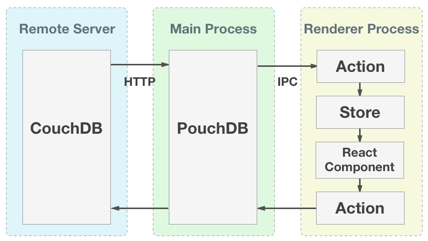

There are two databases in local and on remote and they sync via HTTP(S).
The remote database provides API compatible with CouchDB. You can access your data in the remote database directly with the API as described in the section of [Accessing Data in the Cloud](/manual/accessing-data-in-the-cloud).
The Inkdrop client app is built on top of a [PouchDB](https://pouchdb.com/) for storing data in local and syncing with the remote database. For many parts of the application, the database is the source of truth. Data is written to the local database first, then synced via the API, and changes to the database trigger Actions, Stores and components to refresh their contents. The illustration below shows this flow of data:



## Accessing the PouchDB instance

There is a global variables named `inkdrop` which allows you to access the internal objects of Inkdrop.
It has `main` property, which is a reference to the inkdrop instance in the main process.
To access the local PouchDB instance in the main process:

```js
async function getDatabaseInfo () {
  const db = inkdrop.main.dataStore.localPouch;
  const info = await db.info();
  console.log(info.db_name);
}
```

In this code, `localPouch` is the instance of PouchDB.

<div class="ui info message">
<strong>NOTE</strong>: Returned objects from the database represent <a href="https://github.com/electron/electron/blob/master/docs/api/remote.md#remote-objects">Remote Objects</a>.
</div>

